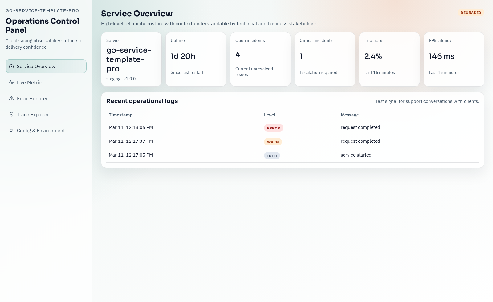
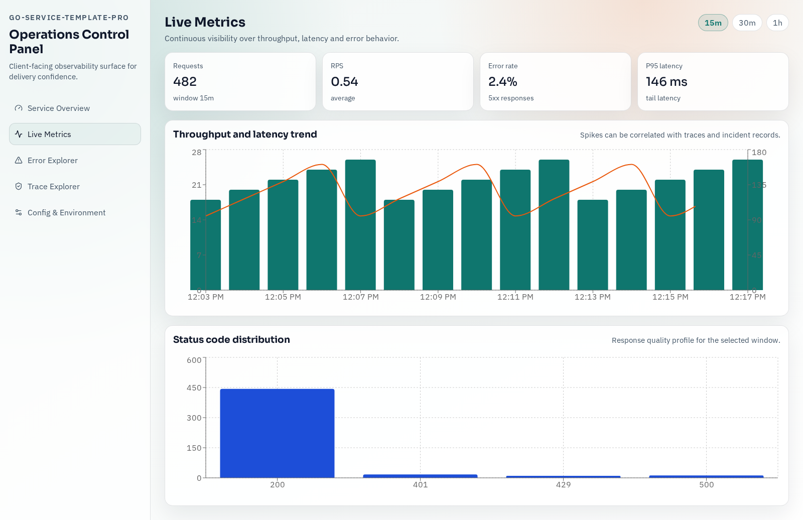
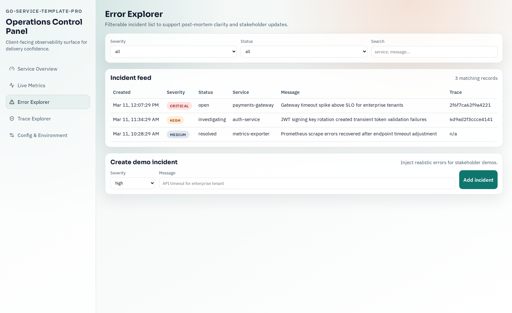
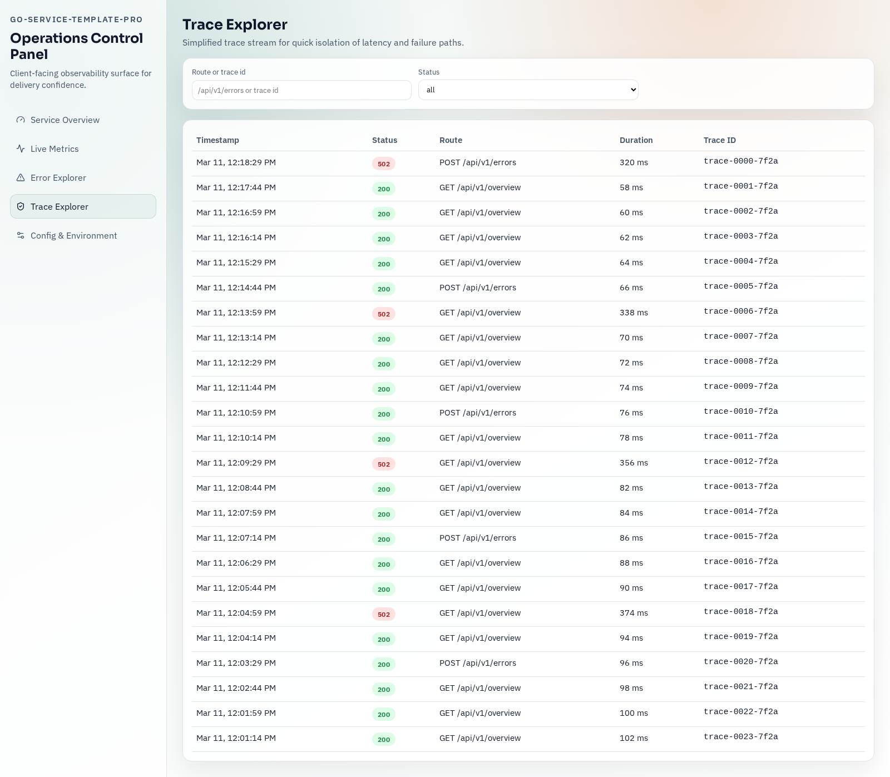
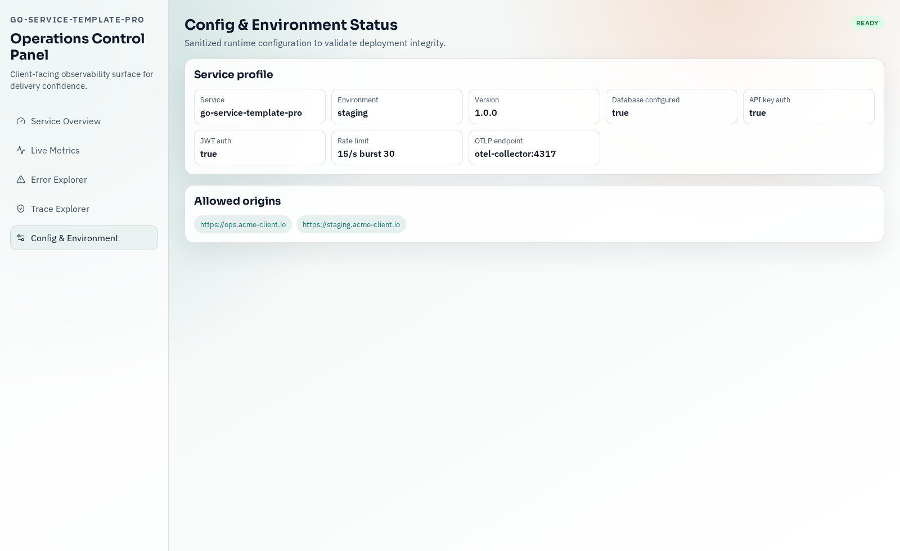

# go-service-template-pro

Production-ready Go microservice template, built as an industrial demonstration for freelance client delivery.

No false claims about certifications or years of experience: this repo proves quality through architecture, reliability controls, and clear operations UX.

## What is included

- Clean architecture backend (domain/application/infrastructure)
- REST API with strict validation
- Typed env config
- Structured logging
- Health/readiness/liveness endpoints
- API key/JWT auth + rate limiting
- OpenTelemetry traces + Prometheus metrics
- PostgreSQL migrations + repository layer
- Coherent API error model
- Operations Control Panel with 5 pages:
  - Service Overview
  - Live Metrics
  - Error Explorer
  - Trace Explorer
  - Config + Environment status
- Docker Compose observability stack (OTel Collector, Prometheus, Grafana, Tempo, Loki)
- GitHub Actions CI + GitHub governance templates

## Quickstart

```bash
make dev
```

Open:
- Ops Panel: http://localhost:3000
- API: http://localhost:8080
- Prometheus: http://localhost:9090
- Grafana: http://localhost:3001 (`admin/admin`)

Generate demo activity:

```bash
./scripts/demo-traffic.sh
```

## Architecture

```text
cmd/service/main.go
internal/domain
internal/application
internal/infrastructure/{db,http,telemetry,repository}
internal/security
internal/store
web/
```

## Technical decisions and tradeoffs

- **Dual auth model (API key + JWT)**  
Tradeoff: simpler than OAuth2 for bootstrap projects, while still robust for production-like service-to-service usage.
- **In-memory ops caches (logs/traces/request snapshots)**  
Tradeoff: very fast UX for demos and early delivery, with clear migration path to dedicated log/trace backends.
- **PostgreSQL + SQL migrations instead of ORM-heavy setup**  
Tradeoff: more explicit SQL ownership, lower abstraction surprises for reliability-focused services.
- **OTel traces + Prometheus metrics**  
Tradeoff: two observability paths to keep vendor neutrality and avoid lock-in.

## Why this reduces delivery risk for clients

1. Monitoring and traceability are present before feature growth.
2. Security and rate limiting are in the default template, not postponed.
3. Strict CI and PR templates make risk/rollback explicit.
4. Stakeholders can read operational status without digging into logs.
5. Handover is easier due to clear structure and conventions.

## Documentation

- [Phase 0 stack validation](docs/phase-0-stack-validation.md)
- [Freelance pitch](docs/pitch-freelance.md)
- [GitHub governance protocol](docs/github-governance.md)
- [PR roadmap](docs/pr-roadmap.md)
- [Demo script](docs/demo-script.md)

## Dashboard screenshots

### Service Overview


### Live Metrics


### Error Explorer


### Trace Explorer


### Config & Environment


## Release targets

- `v0.1.0`: Core API template
- `v0.5.0`: Observability integrated
- `v1.0.0`: Client-facing polished template
